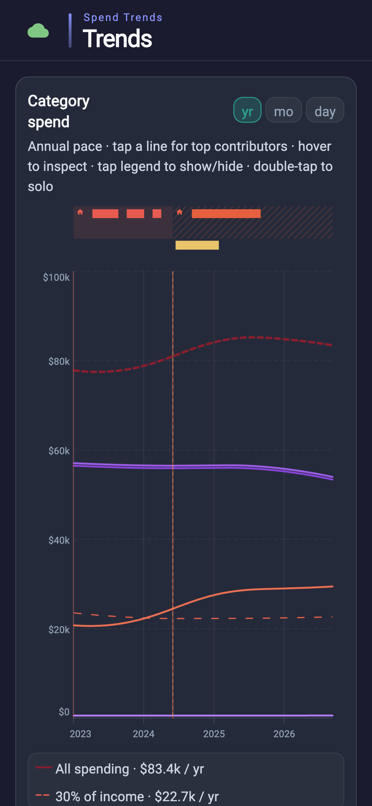

# Spend Trends

Personal **categorical spend trend analysis** for **macOS and iPhone** only. Connect accounts via [SimpleFIN Bridge](https://beta-bridge.simplefin.org/) (or import history), categorize outflows, and read long-term shape per category — not monthly envelope budgeting.

This is a personal app (not a product). The repo is public-safe: bank Access URLs, Setup Tokens, JWT secrets, and LLM tokens live only in a local `.env` (gitignored) and the device keychain — never in git.

### Screenshots



## What it does

- **See whether a category is drifting up or down** — smoothed trailing-year spend lines (total + per category) so long-term shape is readable, not drowned in daily noise.
- **Keep history categorized without babysitting every swipe** — assign a merchant once, add “contains” rules, merge duplicate categories, and optionally let the home-server LLM suggest labels for unknowns.
- **Pull in real bank activity** — connect via SimpleFIN for ongoing sync, or load past exports (Copilot CSV / generic CSV) when you need history a bank connection doesn’t cover.
- **Use the same picture on Mac and iPhone** — local PowerSync store syncs to home-server Postgres so categorization and trends stay shared across devices.

## How it works

```
SimpleFIN Bridge ──HTTP──► App (claim + /accounts)
                              │
                              ▼
              PowerSync DB (spend_trends_powersync.db)
                              │
              ┌───────────────┼───────────────┐
              ▼               ▼               ▼
          Trends UI      Activity UI    Categories UI
                              │
                    ethan_sync ↔ Postgres
                    optional: llm-proxy
```

1. Buy SimpleFIN Bridge (~$15/yr) and create a Setup Token in their UI.
2. Set `POWERSYNC_JWT_SECRET` + `SERVER_HOST_LAN` in `.env` (required), then run the app.
3. In **Settings → Connect**, paste the Setup Token. The app claims an Access URL (`https://user:pass@…/simplefin`), saves it to keychain, and you should also put it in `.env` as `SIMPLEFIN_ACCESS_URL` so it survives reinstall.
4. Sync (or import) loads transactions into PowerSync. Categorization uses sticky merchant → category memory plus explicit rules.
5. Trends charts roll categorized outflows into a trailing 365-day window and smooth for readable lines. Changes upload via PostgREST and download on other devices.

## Code layout

| Dir | Role |
|-----|------|
| `features/shell/` | `MaterialApp` + tab shell |
| `features/trends/` | Smoothed category trend charts (primary tab) |
| `features/*/` | Activity, Categories, Settings UI |
| `domain/` | Models + use cases (ingest, categorize, spend rollups) |
| `services/` | SimpleFIN, PowerSync repos, CSV, LLM, ethan_sync config |
| `providers/` | Riverpod wiring |
| `theme/` | Finance accent overlay (`FinanceColors`); chrome via `ethan_ui` |
| `widgets/`, `util/` | Shared UI/helpers |

## Setup

Sibling path packages (same layout as your other Flutter apps):

- `../ethan_utils`
- `../ethan_sync`
- `../ethan_ui`

```bash
cd ~/code/my-code/Active/Flutter/spend_trends
cp .env.example .env
# Required: POWERSYNC_JWT_SECRET, SERVER_HOST_LAN
# Optional: SIMPLEFIN_ACCESS_URL (after first Connect), LLM_APP_SECRET
flutter pub get
flutter run -d macos
# or
flutter run -d iphone
```

### `.env` keys

| Key | Required | Purpose |
|-----|----------|---------|
| `SERVER_HOST_LAN` | Yes | Home server host |
| `POWERSYNC_JWT_SECRET` | Yes | ethan_sync JWT (raw secret; infra `SPEND_TRENDS_POWERSYNC_JWT_KEY` is its base64url form) |
| `SIMPLEFIN_ACCESS_URL` | After claim | Claimed Access URL (not Setup Token) |
| `LLM_APP_NAME` | Optional | Usually `spend_trends` |
| `LLM_APP_SECRET` | Optional | Must match infra `LLM_SPEND_TRENDS_SECRET` |

`.env` is gitignored and listed as a Flutter asset (same pattern as your other apps). Keep real values only on your machine.

## Infra

Server schema lives in this repo under `db/` and syncs to `../../infra/spend_trends/` for Docker mounts (PowerSync **8083**, PostgREST **3006**). Register `LLM_SPEND_TRENDS_SECRET` on the shared llm-proxy for category suggestions.

## Icon

Source art: `assets/icon/app_icon.png`. Refresh platform assets with:

```bash
dart run flutter_launcher_icons
```

## Platforms

- **macOS** — primary; sandbox off for keychain + network (see Runner entitlements).
- **iOS** — supported.
- **Android** — not a target (personal Apple-device app).
